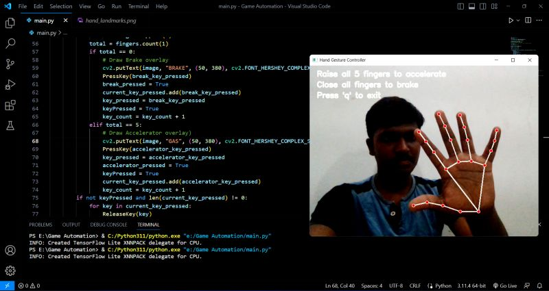

# Game-Automation
The plan is to implement a "BRAKE" overlay when my hand is open with no fingers extended, and a "GAS" prompt when all five fingers are extended, engaging the accelerator in the game! 

## Description

The **Game Automation** project is designed to enhance your gaming experience by allowing you to control in-game actions using hand gestures. The project utilizes computer vision techniques to detect the state of your hand and trigger corresponding actions in the game. Specifically, it implements an "overlay" system that displays prompts such as "BRAKE" and "GAS" based on the configuration of your hand.

## Features

- **Hand Gesture Detection**: The project uses computer vision algorithms to detect the state of your hand, distinguishing between open and closed states, as well as the number of extended fingers.

- **In-Game Prompts**: When your hand is detected in an open position with no fingers extended, an "BRAKE" overlay is displayed in the game. Conversely, when all five fingers are extended, a "GAS" prompt is shown, simulating the action of engaging the accelerator.

- **Customizability**: The project is designed with modularity in mind, allowing you to easily customize the gestures, prompts, and actions according to your preferences.

## Requirements

- Python 3.x
- [OpenCV](https://opencv.org/) library
- Game running in a compatible environment
